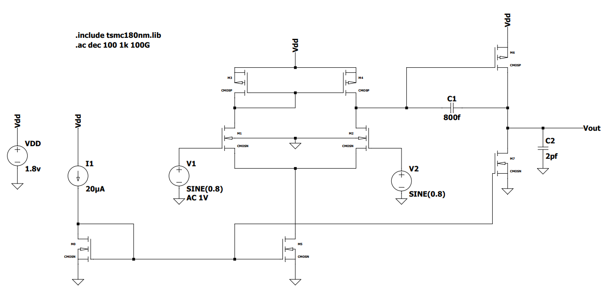
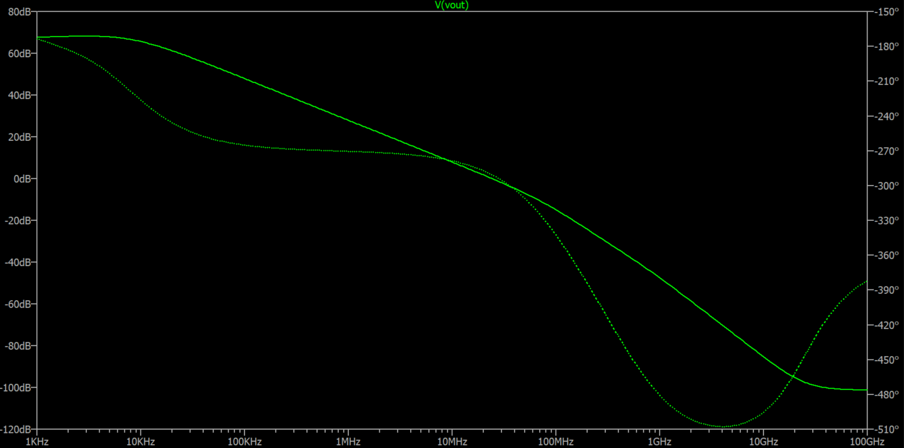

# Two-Stage CMOS Operational Amplifier (180 nm)

Transistor-level implementation and simulation of an unbuffered, Miller-compensated two-stage CMOS operational amplifier designed in TSMC 180 nm technology with a 1.8 V supply. The design targets high gain, 60° phase margin, fast slew rate, and low power under a 2 pF load.

---

## Performance Summary

| Metric | Design Target | Simulated (ICMR+) | Simulated (ICMR−) | Status |
| :--- | :---: | :---: | :---: | :---: |
| **Supply Voltage ($V_{DD}$)** | 1.8 V | 1.8 V | 1.8 V | Met |
| **DC Open-Loop Gain** | $\ge 60\text{ dB}$ | 70 dB | 68 dB | Met |
| **Gain-Bandwidth Product (GBW)** | $\ge 30\text{ MHz}$ | 35 MHz | 31 MHz | Met |
| **Phase Margin (PM)** | $\ge 60^\circ$ | 61° | 65° | Met |
| **Slew Rate (SR)** | $\ge 20\text{ V/µs}$ | 28 V/µs | 28 V/µs | Met |
| **Load Capacitance ($C_L$)** | 2 pF | 2 pF | 2 pF | Met |
| **Power Dissipation** | $\le 300\text{ µW}$ | $< 300\text{ µW}$ | $< 300\text{ µW}$ | Met |
| **Input Common-Mode Range** | 0.8 V – 1.6 V | Verified | Verified | Met |

---

## Schematic & Architecture

The topology consists of an NMOS differential pair with a PMOS current-mirror active load (Stage 1), followed by a PMOS common-source amplifier (Stage 2) and Miller compensation capacitor ($C_c$).

### Sized Components Summary

| Component | Function | Sizing / Value | Key Constraints |
| :--- | :--- | :---: | :--- |
| **M1, M2** | Input Differential Pair | $(W/L) = 6.2$ | $g_{m1} \approx 160\text{ µS}$ for $\text{GBW} \ge 30\text{ MHz}$ |
| **M3, M4** | Active PMOS Load | $(W/L) = 9.5$ | Sized for $\text{ICMR+} \le 1.6\text{ V}$ |
| **M5** | Tail Current Source | $(W/L) = 5.7$ | $I_5 = 20\text{ µA}$, $V_{DSAT5} \le 184\text{ mV}$ for $\text{ICMR-} \ge 0.8\text{ V}$ |
| **M6** | CS Output Driver | $(W/L) = 149$ | $g_{m6} \ge 10 g_{m1}$ ($1.6\text{ mS}$) to push secondary pole |
| **M7** | CS Active Load | $(W/L) = 45$ | Mirrored tail current scaling ($I_7 \approx 158\text{ µA}$) |
| **$C_c$** | Miller Capacitor | 800 fF | $C_c \ge 0.22 C_L$ and $\text{SR} = I_5 / C_c$ trade-off |
| **$C_L$** | Output Load | 2.0 pF | Target output loading |

---

## Simulation Results

Simulated using **LTspice** with BSIM3 Level 49 models.

* **AC Analysis:** DC gain exceeds 68 dB across input ranges, with a stable unity-gain crossover at 31–35 MHz and $> 60^\circ$ phase margin.
* **Transient Analysis:** Fast settling with symmetrical positive/negative slew rate exceeding 28 V/µs.
* **DC Operating Point:** All transistors remain biased in the active (saturation) region across common-mode limits.

---
